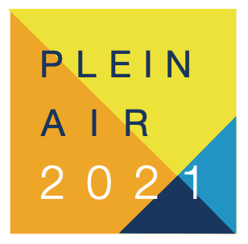

# Projet n°3 - Parcours Php/Symfony - OpenClassrooms
## Analysez les besoins de votre client pour son festival de films

Ce projet est réalisé dans le cadre du parcours **Php/Symfony** du site [OpenClassrooms](https://openclassrooms.com/ "OpenClassrooms")

### Documentations
* [Cahier des charges](./doc/PFILM_01_caherdescharges.pdf)

### Technologies utilisées

  * HTML
  * CSS
  * Sass
  * BootStrap

### Objectifs de la mission
En tant que développeur, on vous demande de lister les fonctionnalités dont a besoin la cliente et de proposer une solution technique adaptée. Vous devez donc sélectionner la solution qui vous semble la plus à même de répondre à son besoin : quels outils utiliser, éventuellement un CMS, etc.

Vous devrez ensuite réaliser une première maquette de ce site correspondant à ses attentes, en utilisant uniquement HTML et CSS.

### Compétences évaluées
* Choisir une solution technique adaptée parmi les solutions existantes si cela est pertinent
* Lister les fonctionnalités demandées par un client
* Analyser un cahier des charges
* Rédiger les spécifications détaillées du projet
